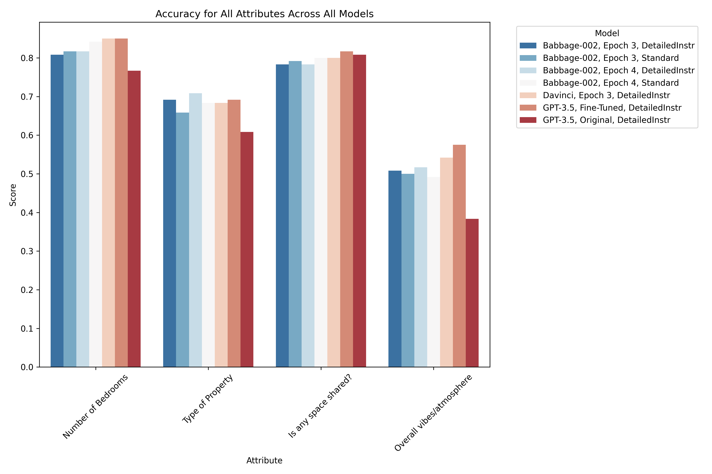
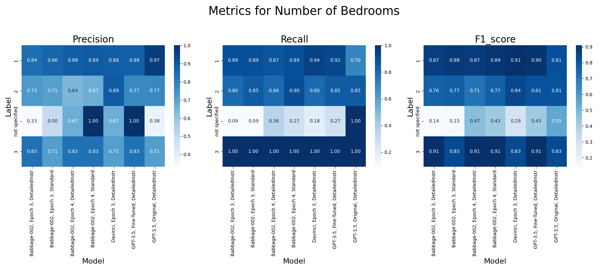
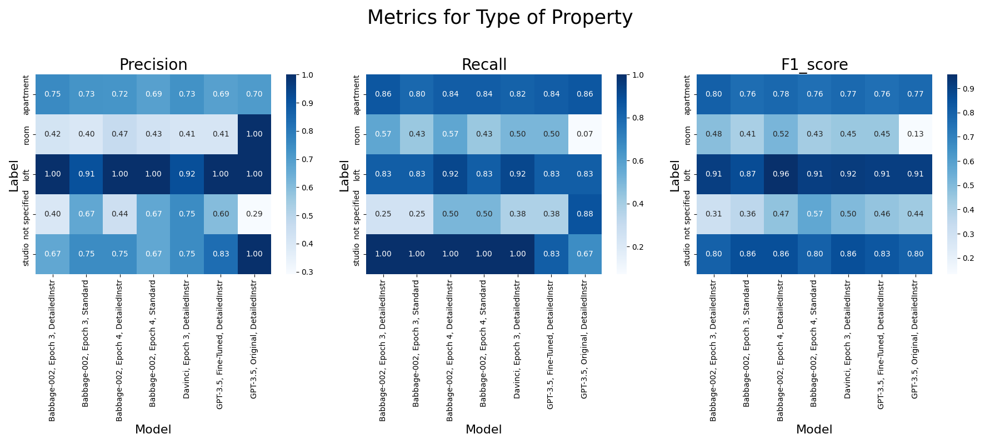
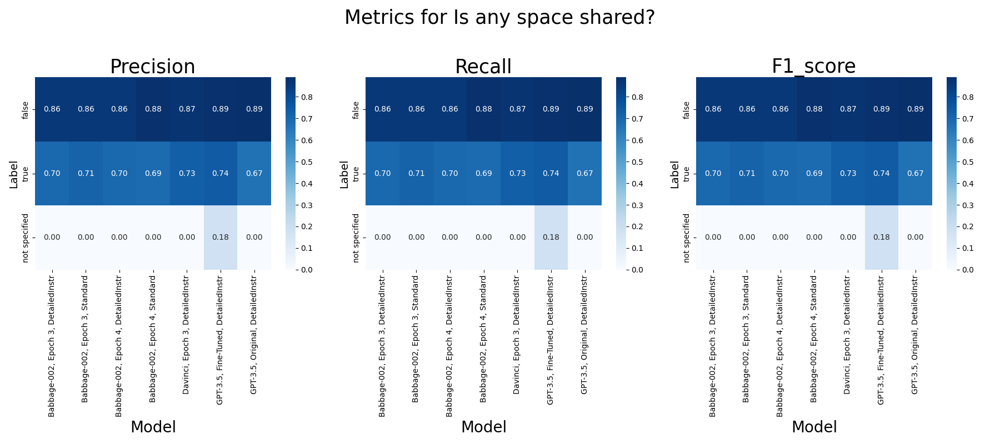
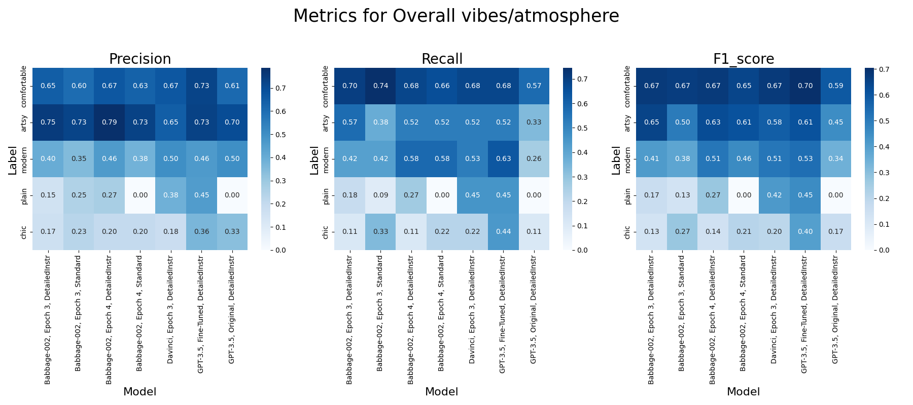

# FPT Assignment

## TL;DR
Fine-tune a pre-trained LLM (Large Language Model) to convert unstructured data (natural language text) into structured data (JSON format) for various business use cases.

## App Demo
Follow this link to test the application: https://ntl2105-fpt-assignment-model-tester-streamlit-appapp-e3chlz.streamlit.app/

## Business Use Case
Transforming unstructured text into structured data by extracting or inferring relevant information. The relevance is determined by specific needs.

### Motivations
The ability to structurally analyze large sets of textual data has profound implications across business sectors, including inventory management, diversification of offerings, quality assurance, and risk management. Applications include:

1. **Employment Contracts**: Extracting titles, salaries, specific employment clauses.
2. **Online Marketplaces**: Parsing seller-generated product descriptions.
3. **Meeting Notes**: Identifying blockers, pain points, progress, and action items.

Utilizing advanced LLMs allows for the automation of these extraction tasks, previously handled by multiple processes or models (e.g., regular expressions, NER models, classification models).

## The Problem
Extract and infer four types of attributes from Airbnb listing descriptions:
- **Number of Bedrooms** (integer) | Labels : 1,2,3,4,etc.
- **Property Types** (string) | Labels: home, apartment, townhouse, etc.
- **Shared Space** (boolean) | Labels: true of false 
- **Overall Vibe** (string) | Labels: modern, artsy, comfortable, historic, plain

#### Implications for Airbnb:
- **Operational Efficiency**:
  - **Knowledge Management**: Accelerate the extraction and inference of key information for internal analyses.
  - **Market Analysis**: Identify mismatches in supply and demand, such as the availability of three-bedroom homes in high-demand areas like Manhattan.
- **Strategic Insights**:
  - **Marketing and Recommendations**: Utilize insights on accommodation vibes/atmospheres for targeted marketing and personalized recommendations, enhancing user satisfaction and engagement.
- **Compliance and Ethics**:
  - **Regulatory Compliance**: Automatically flag and review listings for non-compliant or potentially misleading information, ensuring adherence to legal standards and ethical practices.

#### Additional Considerations:
- **Scalability**: Evaluate how the technology can scale in terms of handling varying sizes of data, different languages, and cultural contexts across Airbnb's global marketplace.
- **Technological Advancement**: Consider how advancements in machine learning and natural language processing could continuously improve the accuracy and efficiency of information extraction over time.
- **Sustainability**: Explore the potential for this technology to reduce the environmental impact of Airbnb’s operations by enabling more efficient resource use and supporting sustainable practices in property management.

## Methodology
This is a supervised machine learning problem structured as follows:

### Data Collection
- **Source**: Collect listings from [Inside Airbnb](https://insideairbnb.com).
- **Focus**: Listing titles and descriptions.
### Labels Collection
- **Tool**: Use GPT-4 by OpenAI to generate labels instead of manual annotation.
- **Process**: Various prompts tested to refine label accuracy.

### Model Selection
Experiment with three OpenAI models: Babbage-02, Davinci-02, and GPT-3.5-Turbo.

### Data Preparation for Fine-Tuning
- **Cleaning**: Remove HTML markers and other non-relevant text.
- **Formatting**:
  ```json
  {
    "babbage02": {"prompt": "...", "completion": "..."},
    "davinci02": {"prompt": "...", "completion": "..."},
    "gpt3.5-turbo": {"messages": [{"role": "system", "content": "..."}, {"role": "user", "content": "..."}, {"role": "assistant", "content": "..."}]}
  }
  
- **Data Splitting**: into train, validation, test sets
  
## Fine-Tuning Experiments

I launched 6 fine-tuning jobs, experimenting with:

### Instructions
- **Types of Instructions**: I used two different types of instructions varying in verbosity:
  - **Simple Instruction**: "Given the following Airbnb description, extract the number of bedrooms, determine the type of property, determine whether any space is shared, and classify the overall vibes/atmosphere. Return in JSON format."
  - **Detailed Instruction**: Not included here due to space considerations, but it is highly detailed and the same as previously provided to the annotator (in this case, GPT-4) to obtain the labels.
    - **Explanation**: More detailed instructions help the model understand context, nuances, and rules more effectively, although they may increase compute time and costs due to a higher token count.

### Models Used
- **Babbage-02**: A smaller and faster model suitable for tasks requiring less understanding of complex contexts. Ideal for cost-effective training and inference.
- **Davinci-02**: More capable model, excellent for handling nuanced and complex tasks. Might be overkill for our domain (i.e., Airbnb listings).
- **GPT-3.5-Turbo**: Balances performance and cost, providing a good compromise between the capabilities of Davinci and the efficiency of Babbage.

### Hyperparameter Tuning
- **Epoch Settings**:
  - `n_epoch = 3` (default set to auto, which usually ends up being 3)
  - `n_epoch = 4`
  - **Explanation**: OpenAI suggests there are three hyperparameters we can adjust during the fine-tuning process: `n_epochs`, `learning_rate`, `batch_size`. I opted to try different epoch settings because:
    1. I noticed from earlier fine-tuning that the generated text didn't comply with the desired structured format.
    2. OpenAI's guidance states, "If the model does not follow the training data as much as expected, increase the number of epochs by 1 or 2." This is more common for tasks where there is a single ideal completion, which applies to our case.
  - **Risk of High Epochs**: Potential overfitting.
  - **Note on Learning Rate and Batch Size**: Adjusting these can affect training speed but may lead to suboptimal performance outcomes.

## Additional Tests to Consider
- **Dataset Size Variance**: Training on half the train set to compare performance gains to the full train set.
- **Perfect Small Dataset**: Training on a small (<20 samples), perfectly annotated diverse dataset to compare performance gains to the full train set.

## Evaluation Metrics
Models to be evaluated: 6 fine-tuned models, base GPT-3.5 Turbo 

- **Formatting**: How often did the model return the correct JSON format?
  3 scenarios:
  - ```Correct``` Model output is a directly usable json format
  - ```Fixable``` Model output is not a json format, but contains predictable error patterns that can be systematically addressed and turn into a usable json format
  - ```Unfixable``` Model output is not a json format, and can't yet be automaticaly fixed
Output: Percentage (%) of each of these for the whole test set

Below is a breakdown of json statuses across different models:

| json_status   |   babbage-002 epoch3 |   babbage-002 epoch3 detailedInstr |   babbage-002 epoch4 |   babbage-002 epoch4 detailedInstr |   davinci epoch3 detailedInstr |   gpt3.5-turbo-finetuned detailedInstr|   gpt3.5-turbo-original detailedInstr |
|:--------------|----------------------------:|------------------------------------------:|----------------------------:|------------------------------------------:|--------------------------------------:|-----------------------------------:|-----------------------------------:|
| Fixable       |                    0.733333 |                                       0.9 |                           1 |                                         1 |                                     1 |                                  0 |                                  0 |
| Perfect       |                    0.266667 |                                       0.1 |                           0 |                                         0 |                                     0 |                                  1 |                                  1 |

This table provides a clear overview of the performance metrics.

Output: Qualitative Explanation of error patterns that are fixable 
- **Relevancy of Returned Answers**:
  - How often was each expected field returned? Outout: Percentage(%) of identification for each attribute. Will count as TRUE even if column name isn't an exact match. 
  - Did the output contain information not asked for? Output: Distribution of labels for each attribute.
    
- **Required Information Evaluation**:
  - **Overall**: 
    - Accuracy, precision, recall, F1 scores for each of the attributes.
    - 

### Revised Analysis of Accuracy Table with Context:

1. **Number of Bedrooms:**
   - **Top Performers:** `results_3point5_ft_detailedInstr` and `davinci_epoch3_result_detailedInstr` both achieve the highest accuracy of **0.85**. These models have been fine-tuned with detailed instructions, emphasizing their ability to accurately extract straightforward numerical data when given more context.
   - **Consistent Accuracy:** `babbage-002_epoch4_result` also shows strong performance with an accuracy of **0.8417**, suggesting that increasing the number of fine-tuning epochs enhances the model's consistency, even with standard instructions.
   - **Observation:** This attribute appears to be relatively easier for all models, especially when fine-tuned with detailed instructions.

2. **Type of Property:**
   - **Close Contenders:** Models with detailed instructions (`results_3point5_ft_detailedInstr`, `babbage-002_epoch3_result_detailedInstr`, and `babbage-002_epoch4_result_detailedInstr`) show similar accuracies ranging from **0.6917** to **0.7083**, indicating that detailed instructions are crucial for accurately classifying categorical data.
   - **Slight Drop in Performance:** Models with standard instructions, such as `babbage-002_epoch3_result`, have slightly lower accuracy at **0.6583**, while the lowest performer is `results_3point5_og_detailedInstr` at **0.6083**.
   - **Observation:** Detailed instructions seem to significantly aid in classifying property types, likely due to the variability and complexity of property descriptions.

3. **Is Any Space Shared?:**
   - **Highest Accuracy:** The `results_3point5_ft_detailedInstr` model achieves the highest accuracy of **0.8167**, demonstrating the effectiveness of detailed instructions in extracting binary information.
   - **Stable Performance Across Models:** Most other models, such as `davinci_epoch3_result_detailedInstr` and `babbage-002_epoch4_result`, show slightly lower but still strong accuracies around **0.8**.
   - **Observation:** This indicates that the "Is Any Space Shared?" attribute is generally well-understood by the models, with detailed instructions slightly enhancing performance.

4. **Overall Vibes/Atmosphere:**
   - **Most Challenging Attribute:** All models show lower accuracies for this attribute, with the highest being **0.575** from `results_3point5_ft_detailedInstr`.
   - **Lowest Performer:** The `results_3point5_og_detailedInstr` model has the lowest accuracy at **0.3833**, reflecting the difficulty in classifying subjective and nuanced information without fine-tuning or detailed instructions.
   - **Observation:** This highlights the challenge of extracting subjective data like "Overall Vibes" from unstructured text, where detailed instructions and additional epochs could help, but the attribute remains difficult to predict accurately.

### General Observations:
- **Impact of Detailed Instructions:** Models fine-tuned with detailed instructions generally outperform those with standard instructions, particularly for more complex or subjective attributes.
- **Importance of Epochs:** Models with additional epochs, like `babbage-002_epoch4_result`, show consistent accuracy improvements, suggesting that more training leads to better generalization.
- **Performance Across Attributes:** While numerical and binary attributes (Number of Bedrooms, Is Any Space Shared?) are easier to predict, categorical and subjective attributes (Type of Property, Overall Vibes) benefit significantly from detailed instructions and may require further model adjustments to improve accuracy.

This analysis underscores the importance of both the instructions provided during fine-tuning and the number of epochs in improving the model’s performance across various types of data.

### Digging deeper: Attributes-specific metrics: 
  - **Number of Bedrooms**: Accuracy, precision, recall, F1 scores for labels 1,2 (the most common types)
    
  - **Property Type**: Accuracy, precision, recall, F1 scores for labels "home", "apartment" (the most common types)
    
  - **Shared**: precision, recall, F1 scores
    
  - **Vibe**: precision, recall, F1 scores for each label (modern, artsy, comfortable, historic, plain), Confusion Matrix
    

## Analysis Highlights

### Number of Bedrooms
- **High Precision & Recall**: Strong performance for explicit descriptions like exact bedroom numbers.
- **Ambiguity Challenge**: Mixed results for "not specified" cases, indicating difficulties in ambiguous contexts.

### Type of Property
- **Strong Recognition**: High precision and recall for "apartment" and "loft," especially in Babbage and Davinci models.
- **Weakness**: Lower scores for "studio not specified," highlighting challenges in distinguishing unspecified studio types.

### Is any space shared?
- **High Precision for False**: Models reliably identify non-shared spaces.
- **Recall Variation**: Lower recall for "true" suggests missed mentions of shared spaces.

### Overall Vibes/Atmosphere
- **Best Performance**: "Artsy" and "comfortable" receive higher scores, likely due to distinct training data representation.
- **Subjectivity Issues**: "Chic" and "plain" exhibit low precision and recall, pointing to difficulties with subjective descriptions.

### Key Observations
- **Model Consistency**: Babbage-002 and Davinci show robustness across various attributes, suitable for accurate property description tasks.
- **Subjectivity Challenge**: Lower performance on subjective or less defined attributes underscores the need for enhanced training or refined post-processing.

### Recommendations
- **Optimal Model Usage**: Employ Babbage-002 and Davinci for critical accuracy needs, especially for well-represented attributes.
- **Enhanced Training**: Broader training datasets could improve recognition of rarer or subjective descriptions.
- **Post-Processing Improvements**: Additional steps to address ambiguities may improve metrics in challenging labels.

